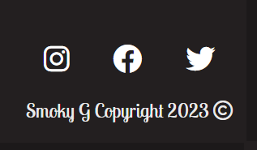
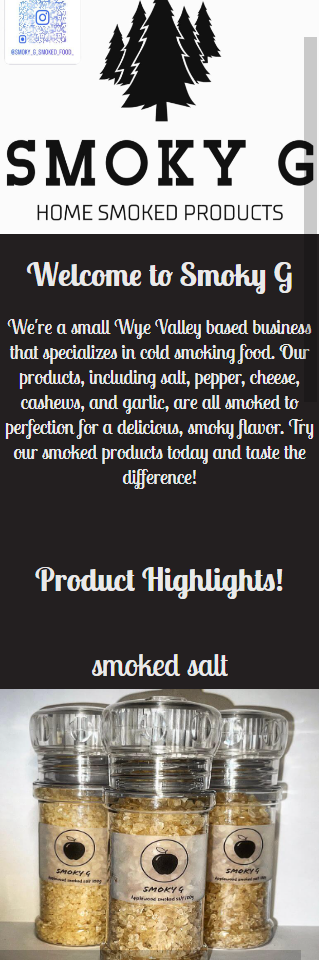
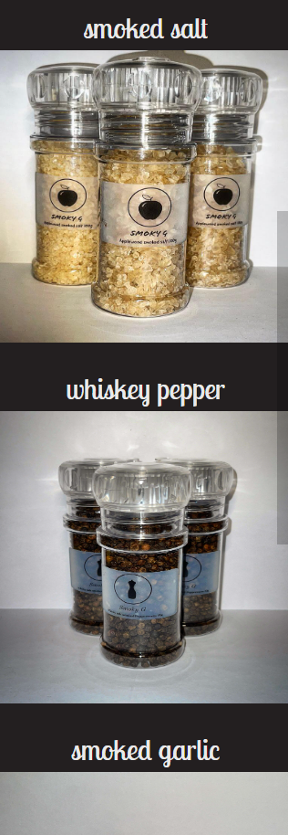
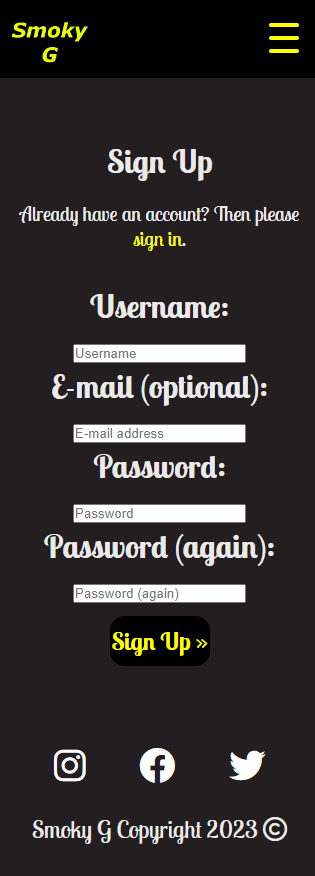
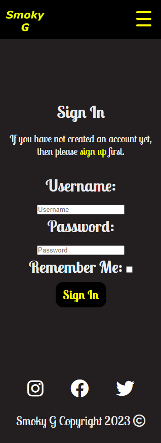
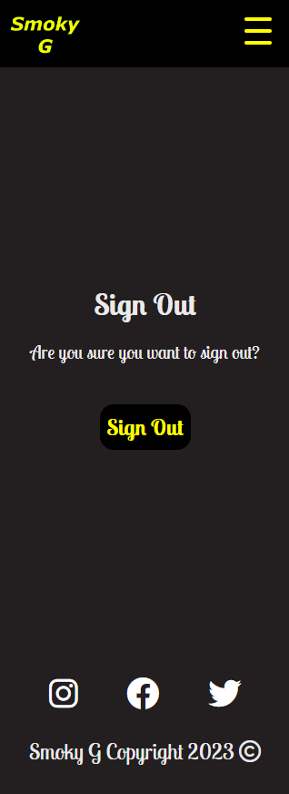
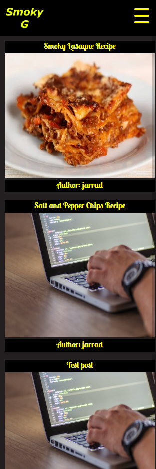
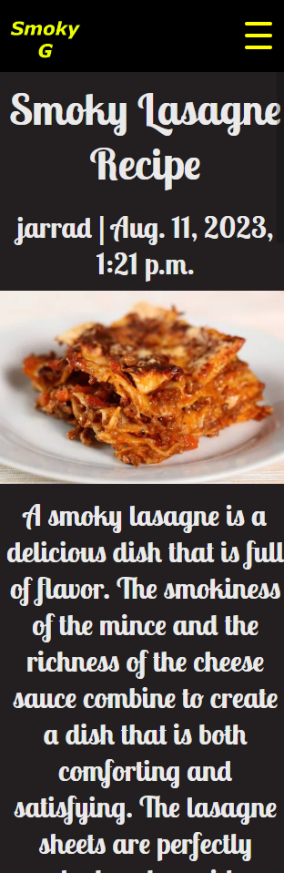

# Skate Shack
(Developer: Jarrad Baker)

[Live webpage](https://jarradbaker.github.io/CI_PP1_SkateShack/)

## Table Of Contents

1. [Project Goals](#project-goals)
  1. [User Goals](#user-goals)
  2. [Website Owner Goals](#website-owner-goals)
2. [User Experience](#user-experience)
    1. [Target Audience](#target-audience)
    2. [User Requrements and Expectations](#user-requirements-and-expectations)
    3. [User Stories](#user-stories)
3. [Design](#design)
    1. [Design Choices](#design-choices)
    2. [Colour](#colour)
    3. [Fonts](#fonts)
    4. [Structure](#structure)
    5. [Wireframes](#wireframes)
4. [Technologies Used](#technologies-used)
    1. [Languages](#languages)
    2. [Frameworks and Tools](#frameworks-and-tools)
5. [Features](#features)
6. [Testing](#validation)
    1. [HTML Validation](#HTML-validation)
    2. [CSS Validation](#CSS-validation)
    3. [Accessibility](#accessibility)
    4. [Performance](#performance)
    5. [Device testing](#performing-tests-on-various-devices)
    6. [Browser compatibility](#browser-compatability)
    7. [Testing user stories](#testing-user-stories)
8. [Bugs](#Bugs)
9. [Deployment](#deployment)
10. [Credits](#credits)
11. [Acknowledgements](#acknowledgements)

## About
Smoky G is a website for a company by the same name. It sells smoked produce, and the website offers a range of features. It has blog posts, which enables users to read the information in the posts, as well as like the posts, and comment on them. It also offers a booking system, where users can book sessions with a representative to  run through a few of the products, and where you could use them in your day to day life.

## Project Goals

### User Goals
- Ability to read, comment on, and like blog posts.
- Ability to amend/edit their comments.
- Ability to delete their comments.

### Website Owner Goals
- Provide more information about the company and products to the users through blog posts, bookings and images.
- Allow users to engage and communicate about the products, and company through comments, likes and bookings.

## User Experience

### Target Audience
The website is designed with the following target audience in mind:
- People interested in soked produce
- Current and Potential customers
- People that work in the food industry

### User Requirements and Expectations
- Fully Responsive
- Full Accessibility
- Easy to Navigate
- Social Media Links

### User Stories

#### First Time User
1. As a user, I want to be able to see the products
2. As a user, I want to be able to  navigate the site easily through headers, footers and menus
3. As a user, I want to be able to read blog posts
4. As a user, I want to be able to create an account
5. As a user, I want to be able to log in to the site
6. As a user, I want to be able to comment on blog posts
7. As a user, I want to be able to amend/edit my comments
8. As a user, I want to be able to delete my comments
9. As a user, I want to be able to create customer service bookings
10. As a user, I want to be able to amend/edit customer service bookings
11. As a user, I want to be able to delete customer service bookings

#### Admin
12. As an admin, I want to be able to login to the admin panel
13. As an admin, I want to be able to see the tables from the admin panel
14. As an admin, I want to be able to be able to approve/reject user's comments
15. As an admin, I want to be able to add/remove products
16. As an admin, I want to be able to add/remove blog posts

#### Site Owner
17. As a site owner, I want to ensure the users have a seamless experience through sensible navigation and apps.
18. As a site owner, I want to ensure all data entered is valid, to avoid potential errors.

## Design

### Design Choices
The website was designed for the owner of the business, so they had a strong influence on colour themes and such. We then worked out the best way to use these colours to draw user attention, while still maintaining readability and accessibility.

### Colour
The client wanted to use yellow/gold, black, white, and red as the main colours for the website. We sharpened these and added a grey also to provide a good contrast, without overpowering the fell of the site with too much black.

### Fonts
Fonts were another aspect worked through with the client. He opted for the lobster fonts, as he wanted a stylish looking font that was still readable.

### Structure
The project structure is broken down in to two areas. There is the web pages area, and the django project area. The web pages area is broken down to the main pages, and views that the website has, and the django project area is broken down into the projewct directory, and app directories. The web pages are kept within the templates folder in the django project directory.

### WebPages
- Homepage - main homepage for the website. Shows products from Products table.
- Blog - list of blog posts that users can click to read the full post.
- Post Details - the html page that loads for each full post, showing the title, author, content, image and comments/likes.
- Login - the login form for the site.
- Signup - the signup form for the site
- Logout - the logout page for the site
- Booking - the booking page where users can book calls.
- My Bookings - the page where users can delete/amend bookings.

### Django Project
- smoky_g - Main project directory
- blog - App directory

### Database
- The database is a PostgreSQL database. It is hosted on ElephantSQL.

### Data Models:

### Wireframes

index

blog

post_detail

bookings

my_booking

login

register

logout

### Agile Design
 I used Agile Design within this project to help me plan out different sprints, and improve productivity, and efficiency. I did this by using Github's Projects, Boards, Milestones, and Issues to develop User Stories, and Epics, which were then planned out over various sprints. The use of Agile in this project proved much more successful than working on previous projects, as I found it much easier to focus on finishing the specific functionality that I was working on.

## Technologies Used

### Languages
The following languages were used to develop the website:
- HTML
- CSS
- Python3
- Django
- Javascript
- SQL

### Frameworks and Tools
The following frameworks and tools were used to develop the website:
- Git
- Github
- Gitpod
- Google Fonts
- Font Awesome
- Balsamiq
- Favicon.io
- Chrome/Chrome dev tools
- Am I Responsive
- Cloudinary
- Elephant SQL

## Features
The website contains a total of 12 features

### Header (logo and navigation)
- Shows on every page
- Enables easy and smooth navigation
- User Stories: 2, 17

Header

  

### Footer
- Shows on every page like the header
- Like the header, the social links also stack underneath the copyright text on smaller screens
- User Stories: 2, 17

Footer

  

### Home
- The home page
- Shows the hero image, and lists the products
- User Stories: 1

Home

  

### Featured Products
- Shows featured products on Home page
- Pulls them from database
- User Stories: 1

Featured Products

  

### Bookings
- User Stories: 10

Featured Products

  

### My Bookings
- User Stories: 11, 12

Featured Products

  

### Register/Signup
- Allows users to register/signup
- Enables commenting
- User Stories: 4, 19

Register/Signup

  

### Login
- Allows users to login
- Enables commenting
- User Stories: 5

Login

  

### Logout
- Allows users to logout
- User Stories: 6

Logout

  

### Blog Page
- Shows published blogs ordered by created date
- User Stories: 3

Blog Page

  

### Post Details
- Shows the entire blog posts
- User Stories: 3, 7, 8, 9

Post Details

  

### Comments
- Allows users to add/amend/delete comments
- User Stories: 7, 8, 9

Comments

  

### Admin Panel
- Allows admins to moderate posts and content
- Allows adding and removing of blog posts and products
- User Stories: 13, 14, 15, 16, 17

Admin

  

### 404 Page
- Shows Custom 404 page
- User Stories: 

404

  

## Validation

### HTML Validation

The Nu HTML Checker (W3C) is used to validate HTML documents. This ensures that all unintended mistakes are spotted before release, so that they can be corrected. All of my pages passed the check without any errors, including the 404 page.

index

blog

post_detail

bookings

my_booking

login

register

logout

### CSS Validation

The W3C Jigsaw CSS Validation Service is used in exactly the same way as the Nu HTML Validator, but for CSS. I ran both my actual style.css file, and an actual web page through it, and both passed without any errors.

Web Page

Stylesheet

### Accessibility

The WAVE web accessibility evaluation tool by WebAIM was used to ensure the webpages met accessibility standards. All 5 pages passed without any errors.

index

blog

post_detail

bookings

my_booking

login

register

logout

### Performance

The Google Lighthouse tool, within the Google Chrome Developer Tools was used to ensure that each page met a high performance rating. This shows that the website will load efficiently over various devices.

index

blog

post_detail

bookings

my_booking

login

register

logout

### Performance tests on various devices

Throughout development and testing, I used the following devices to ensure that the site was responsive, and worked as intended.

- Samsung Galaxy ZFold 5 (both ultra slim mode, and wide mode)
- Microsoft Surface Book 2 (Both as the laptop, and tablet)
- Macbook Pro
- Desktop PC with a 32" monitor

### Browser Compatibility

The website was tested on several web browsers to ensure consistency. The browsers used are as follows:

- Microsoft Edge
- Google Chrome
- Brave Browser (A Chrome based browser)
- Mozilla Firefox
- Opera GX

### Testing User Stories

1. As a first time user, I want to understand the product

| **Feature** | **Action** | **Expected Result** | **Actual Result** |
|-------------|------------|---------------------|-------------------|
| Tricks | Navigate to the Tricks page and find any Trick | See the tricks | Works as expected |
| Trick Videos | Navigate to the Tricks page and find any Trick Video | See the trick videos | Works as expected |
| Why Choose Us? | Navigate to the Home page and scoll down | See the Why Choose Us? section | Works as expected |
| Boards | Navigate to the Boards page | See the page containing all the products | Works as expected |
| Products | Navigate to the Boards page, and scroll down | See all of the products available | Works as expected |

Screenshots

  

Tricks

    
  

  

Tricks Videos

    
  

  

Why Choose Us?

    
    
  

  

Boards

    
  

  

Products

    
  

## Bugs

| **Bug** | **Fix** |
|---------|---------|
| Blog posts not loading correctly | Changed the URL mapping, as the changes for loading the actual post_detail broke the originals |
| Model and Admin view for the blog posts | The admin view was very messy. Tidied by loading and arranging by certain columns |
| Comments not adding correctly | Accidentally referred to the blog variable instead of post |

## Deployment

The website was deployed through the use of GitHub Pages, a feature built in to GitHub. This can be done by following the steps below.
1. In the desired repository, click on "Settings" from the top menu.
2. From the side menu to your left, select "Pages" in the "Code and automation" section.
3. Make sure the "Source" option is set to "Deploy from a branch"
4. Select the desired "Branch" from the drop down below (main branch in most cases, making sure the director is set to /(root)).
5. Select "Save", and after it refreshes the page, you will see a box at the top of the page providing you with the URL of your now published site.

You can fork my, or any other repository by doing the following.
1. Go to the desired repository
2. Click "Fork" in the upper right corner
3. Select the owner, and set the repository name. A description can be added if desired
4. Choose whether to copy the default branch, or all branches
5. Click "Create Form"

You can clone a repository by following the steps below.
1. Go to the desired repository
2. Click the "Code" button at the top of the files section of the page
3. Select your desired method for cloning (HTTPS/SSH/GitHub CLI)
4. Open Git Bash
5. Change the current working directory to the location where you want the cloned directory
6. Type "git clone", and then paste the URL you copied earlier. It will look like this, with your GitHub username instead of "YOUR-USERNAME": "$ git clone https://github.com/YOUR-USERNAME/DESIRED-REPOSITORY"
7. Press Enter. Your local clone will be created.

## Credits

### Media

#### Images

- The logo, hero image, and product images were all provided by the client "Smoky G".

### Code

- HTML: "i" tags with the icons and the social media link icons were all imported from FontAwesome.
- CSS: The font "Lobster" and "Lobster 2" were imported from Google Fonts.

## Acknowledgements

I would like to take this opportunity to acknowledge and thank the following people:
- My mentor Mo Shami for continuous guidance and support.
- My mother, who always encouraged me to strive for a career that I enjoy.
- My peers on the Code Institute Slack channels, for advice and feedback.
- My partener Kirsty, for her belief in me, supporting me, encouraging me, and giving me the invaluable time needed to develop my skills
